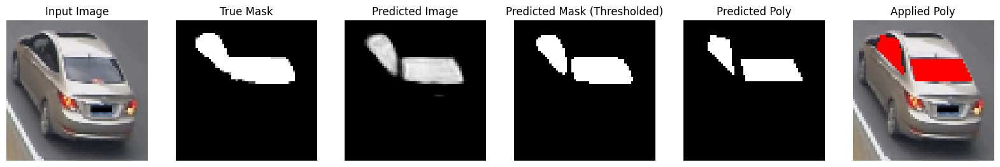
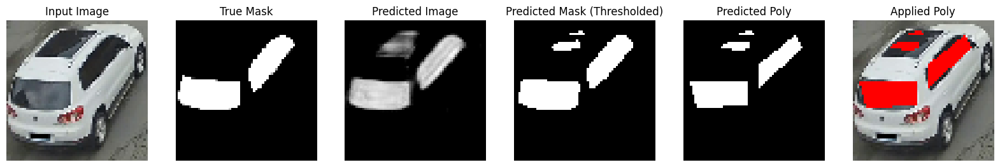
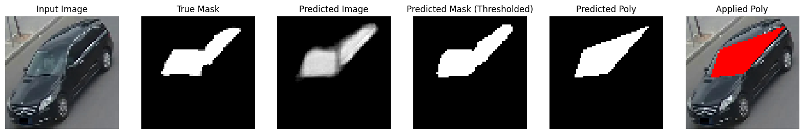
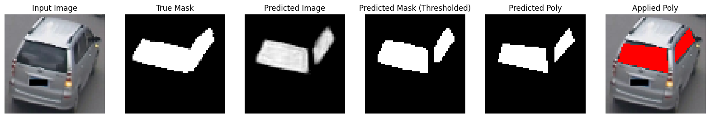
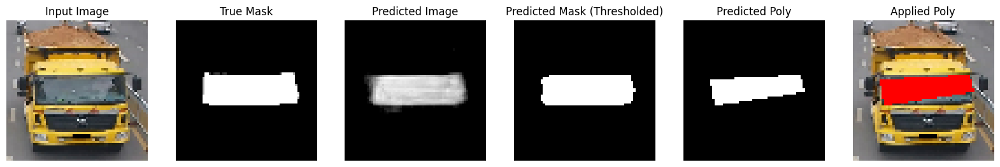
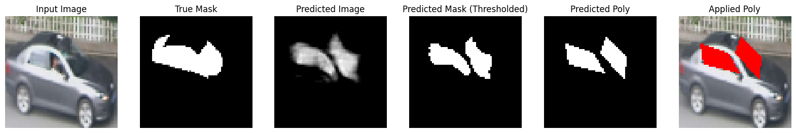
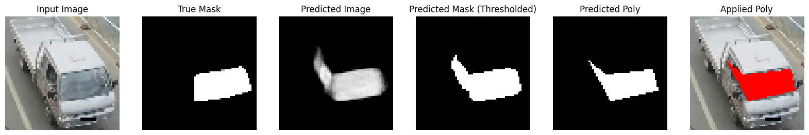
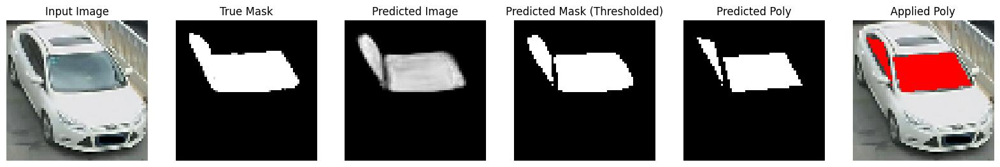

# Windshieldobfuscation

This is a simple attempt to create a segmentation autoencoder that detects Vehicle windshields and obfuscate them using tensorflow and cv2.

Inspired by https://github.com/animikhaich/Semantic-Segmentation-using-AutoEncoders

# datasets
- MVP for annotations (https://github.com/lxc86739795/human_vehicle_parsing_platform)
- VeRi for cars (https://vehiclereid.github.io/VeRi/)

# Simple Results

    

    

    

    

    

    

    

    

